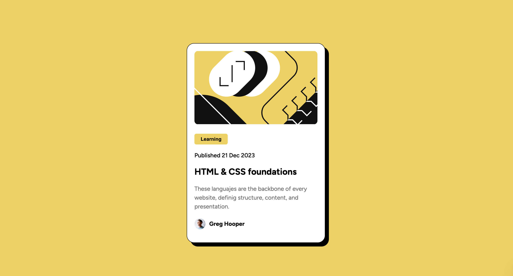

Blog Preview Card Component

🌟 Descripción

Este proyecto es parte de un desafío de Frontend Mentor. El objetivo es construir una tarjeta de vista previa de blog que se asemeje lo más posible al diseño proporcionado. Es una excelente oportunidad para mejorar habilidades en HTML y CSS.

🛠️ Tecnologías Utilizadas
• HTML5
• CSS3

📂 Estructura del Proyecto
• /design: Contiene vistas previas de los diseños para dispositivos móviles y de escritorio.
• /assets: Recursos optimizados, como imágenes necesarias para el proyecto.
• /fonts: Fuentes utilizadas en el proyecto.
• style-guide.md: Guía de estilos con detalles sobre colores, fuentes y espaciados.
• index.html: Archivo principal con la estructura HTML del proyecto.
• styles.css: Archivo con los estilos personalizados para el componente.

🚀 Cómo Usar

1. Clona el repositorio con el siguiente comando:
   git clone https://github.com/WilliamCuc/blog-preview-card-main.git
2. Abre el archivo index.html en tu navegador.

🌐 Deploy

El proyecto está desplegado en Netlify.
https://blogpreviewcardpj.netlify.app/

✨ Aprendizajes

• Práctica de maquetación con HTML y CSS.
• Ajuste de estilos para diferentes tamaños de pantalla.
• Uso de propiedades CSS como flexbox.

📸 Vista Previa

📝 Créditos

Diseño proporcionado por Frontend Mentor. Proyecto desarrollado por William Cuc.
